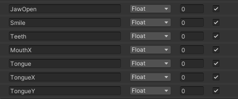
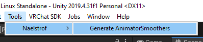
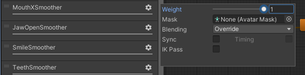
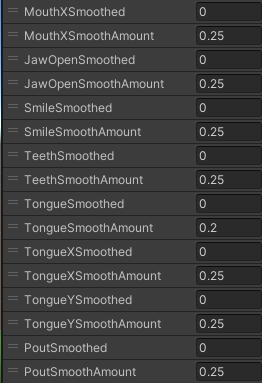

# VRCLipSyncOSC

A lightweight C++ implementation of HTC Lipsync -> VRChat OSC. Configured with lua!

Its intention is to allow users to convert raw HTC lipsync variables into usable floats within VRChat for facetracking and the like.

## Features

* Lua powered! Compress and massage the data into usable avatar parameters using simple lua configuration.
* Share the `config.lua` with your friends! Get exactly the configuration that works for you and your community.
* Doesn't busy-wait! HTC's very own unity package spawns a worker thread that entirely occupies a core waiting for new data... :pensive: This app doesn't do that.
* Really tiny! Entire package is under a megabyte.

## Installation

1. Download and install the SRanipal Runtime found here (account required): https://developer-express.vive.com/resources/vive-sense/eye-and-facial-tracking-sdk/download/latest/
2. Then simply run the executable found within [Releases](https://github.com/naelstrof/VRCLipSyncOSC/releases).

## Usage (Avatar Setup)

Warning: This section assumes you have decent tech-artists skills, and that you're using the default `config.lua` included with the package.

1. Set up the following Avatar Parameters as floats:

```
JawOpen
Smile
Teeth
MouthX
Tongue
TongueX
TongueY
Pout
```


2. Set up the following blends on your avatar:

Teeth/Lips blend:

https://user-images.githubusercontent.com/1131571/166071983-ea8a2420-80d1-4c8f-b679-37e6aa63a3a5.mp4

Smile blend:

https://user-images.githubusercontent.com/1131571/166072027-b1d470ce-fd2b-4a80-b846-a38084b037c1.mp4

Tongue blend

https://user-images.githubusercontent.com/1131571/166072048-e6479a43-01bd-4fbc-9bcd-c58038f36ef3.mp4

Jaw blend

https://user-images.githubusercontent.com/1131571/166072089-06c102c5-bb01-443c-8eff-005cef595715.mp4

Pout blend

https://user-images.githubusercontent.com/1131571/166072109-9fd08604-ed50-4d41-99f1-88a9887012a5.mp4

With the blends set up, now we need to tackle one last problem. OSC parameters only update about 4 times a second for other players, to prevent it from being choppy we can use [hai's implementation](https://hai-vr.notion.site/Avatars-3-0-Animated-Animator-Parameters-and-Smoothing-f128c71dd3184c2bb61a4cff8296ada5#aeb2d0d54edf41e1a846818657dfc1b7) of Animator smoothing to have it appear smooth for other players.

3. Copy AnimatorSmoother.cs (included in the package) into your Unity project somewhere.

4. Select your Animator in the Project tab, then hit Tools->Naelstrof->Generate Animator Smoothers.



This should generate a bunch of new parameters and layers designed to smooth the original values, it's very dumb and will generate them for ALL float parameters though.

5. Delete unecessary smoothing layers (GestureLeftWeightSmoother and the like). We only want to smooth the face-tracking OSC parameters.

6. Ensure that the smoothing layers have a weight of 1.



7. Customize the SmoothAmount of each parameter, it represents how slowly it moves toward the desired value. A value of 0.25 is a pretty good starting point.



8. Finally, use the `Smoothed` version of the variables within all of your blends.

9. You're done! Test your changes in VR with the VRCLipSyncOSC app running.

## Usage (VRCLipSyncOSC configuration)

1. All configuration happens within config.lua. lipdata is a table with the following keys:
```
Jaw_Right
Jaw_Left
Jaw_Forward
Jaw_Open
Mouth_Ape_Shape
Mouth_Upper_Right
Mouth_Upper_Left
Mouth_Lower_Right
Mouth_Lower_Left
Mouth_Upper_Overturn
Mouth_Lower_Overturn
Mouth_Pout
Mouth_Smile_Right
Mouth_Smile_Left
Mouth_Sad_Right
Mouth_Sad_Left
Cheek_Puff_Right
Cheek_Puff_Left
Cheek_Suck
Mouth_Upper_UpRight
Mouth_Upper_UpLeft
Mouth_Lower_DownRight
Mouth_Lower_DownLeft
Mouth_Upper_Inside
Mouth_Lower_Inside
Mouth_Lower_Overlay
Tongue_LongStep1
Tongue_LongStep2
Tongue_Down
Tongue_Up
Tongue_Right
Tongue_Left
Tongue_Roll
Tongue_UpLeft_Morph
Tongue_UpRight_Morph
Tongue_DownLeft_Morph
Tongue_DownRight_Morph
```
You can find out what the keys represent by checking out HTC Vive's official documentation here: https://developer-express.vive.com/resources/vive-sense/eye-and-facial-tracking-sdk/documentation/

2. config.lua must have an update function that takes the lipdata table, this is ran every update in order to send data to VRChat.
3. All parameters should be normalized (0 to 1), otherwise the animation smoother trick won't work correctly.
4. Make sure to call `SendData("/avatar/parameters/myparameter", value)` before the end of `update` in order to send the parameters to VRChat. The values are cached and sent at the end.
5. If there's an error in `config.lua`, the executable will report the error and immediately close. A convenience bat file has been included so that the error message can be read. Use it if the executable flashes or blinks when you run it.
